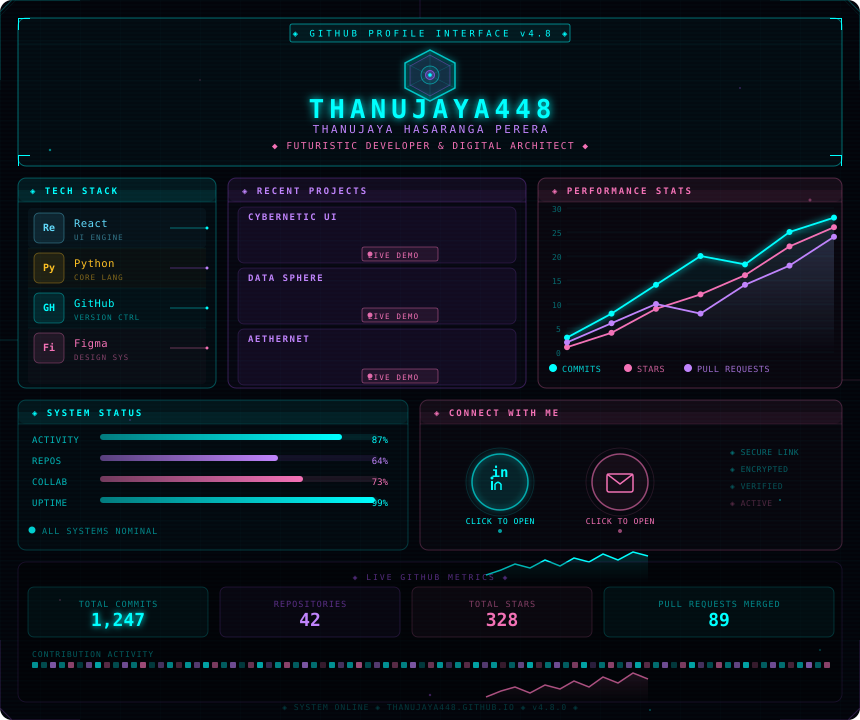

---

## ◈ LIVE GITHUB STATS ◈

<!-- Replace THANUJAYA448 with your exact GitHub username if different -->

---

<!-- 
  HOW TO SET UP:
  1. Create a public repo named exactly: THANUJAYA448
  2. Upload github_profile_dashboard.svg and this README.md to it
  3. Edit the LinkedIn URL: replace YOUR_LINKEDIN_HERE with your profile slug
  4. Edit the Email: replace YOUR_EMAIL_HERE with your real email
  The GitHub stats cards will auto-load your REAL data automatically.
-->
